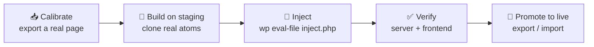

# Elementor Skill for Claude Code

> Build and edit **Elementor** pages on **any** self-hosted WordPress straight from the
> CLI — Claude generates the page's `_elementor_data` JSON and injects it with WP-CLI,
> instead of clicking through the visual editor.

A portable [Claude Code](https://docs.claude.com/en/docs/claude-code) **skill**. Point
Claude at a real page to learn your site's design, then ask it to build pages that match —
one page or fifty. Works over SSH, on managed hosts, or fully local.

- ⚡ **Build pages from a prompt** — "build a Services page that matches this site."
- 🎯 **Matches your design** — clones your real widgets, spacing, and brand colors (no generic output).
- 🌐 **Host-agnostic** — generic SSH+WP-CLI, Kinsta / WP Engine / Flywheel, or local (DDEV / LocalWP).
- 🔒 **Staging-first & safe** — builds drafts on staging, verifies, then promotes.
- 📦 **Zero secrets** — no credentials or client data; safe to fork and share.

---

## How it works



An Elementor page is just a JSON tree stored in postmeta `_elementor_data`. The skill
reads a real page from your site (**calibration**) so it learns your exact widgets and
global-kit color/typography IDs, then **clones and re-contents** those elements into a new
page and injects it with one WP-CLI call. That's why the output matches your site instead
of looking like a template.

---

## Supported hosts

| Your setup | Access guide | How `wp` runs |
|---|---|---|
| VPS / DigitalOcean / cPanel / self-managed (you have SSH) | [`hosts/generic-ssh.md`](hosts/generic-ssh.md) | `ssh host "cd WEBROOT && wp …"` |
| Kinsta · WP Engine · Flywheel (managed) | [`hosts/managed-wp.md`](hosts/managed-wp.md) | SSH gateway → `wp …` |
| Local: DDEV · LocalWP · wp-env · Studio | [`hosts/local.md`](hosts/local.md) | `ddev wp …` / `wp …` |

Other hosts (e.g. Cloudways) work too — the build technique is identical; you just need
that platform's way to open a shell and find the webroot.

---

## Install

**Option A — git clone (recommended; gets `git pull` updates):**

```bash
git clone https://github.com/get-proofpilot/claude-elementor-skill.git ~/.claude/skills/elementor
```

Project-scoped instead of global? Clone into your repo: `…/.claude/skills/elementor`.

**Option B — download ZIP:** click **Code ▸ Download ZIP** above, unzip, and move the
folder to `~/.claude/skills/elementor`.

Then restart Claude Code (or start a new session). Confirm the skill named **`elementor`**
appears in the available-skills list.

**Update later:**
```bash
cd ~/.claude/skills/elementor && git pull
```

---

## First-time setup (once per site)

Before your first build, teach the skill your site's design — this is the step that makes
new pages match. See **[`SETUP.md`](SETUP.md)** for the full walkthrough. The short version:

- **No shell?** In the Elementor editor: **Save as Template → Templates → Export** → hand
  Claude the `.json`.
- **Have WP-CLI?**
  ```bash
  wp option get page_on_front                                   # homepage post ID
  wp post meta get <ID> _elementor_data --format=json > homepage.json
  ```

See [`samples/homepage.example.json`](samples/homepage.example.json) for the exact shape
your export should take.

---

## Use

Just ask in plain language — the skill auto-triggers on Elementor / WordPress page-build
requests, or invoke it explicitly with `/elementor`:

- *"Calibrate from `homepage.json`, then build a Services page that matches this site."*
- *"Generate 8 location pages in Elementor from this spreadsheet."*
- *"Edit the hero section on the About page's `_elementor_data`."*

---

## What's in here

| File | Purpose |
|---|---|
| [`SKILL.md`](SKILL.md) | The skill — host-agnostic build technique + golden path |
| [`SETUP.md`](SETUP.md) | **Start here** — export your design (calibration) so builds match it |
| [`inject.php`](inject.php) | WP-CLI injection template (`wp eval-file`) |
| [`reference.md`](reference.md) | WP-CLI recon / inject / verify cheat-sheet |
| [`samples/homepage.example.json`](samples/homepage.example.json) | Redacted 2-section page showing the expected `_elementor_data` shape |
| [`hosts/`](hosts/) | Per-platform access guides (generic SSH, managed WP, local) |

## Requirements

- WordPress with **Elementor** active on the target site.
- A way to run **WP-CLI** against it — SSH, managed-host shell, or local (see `hosts/`).
- `jq` locally is handy for validating generated JSON.

## Safety

Always build on **staging** (or local) as a **draft / noindex** page, and take a
`wp db export` backup before touching a live site. Promote to live only after review. The
skill defaults to this workflow.

## Contributing

Issues and PRs welcome — especially new `hosts/*.md` adapters for other platforms. Keep the
skill free of credentials and client-specific data.

## Credits / prior art

- [lmoncany/elementor-claude-skill](https://github.com/lmoncany/elementor-claude-skill) — WP-CLI injection technique
- [emersimeon/claude-elementor-kit](https://github.com/emersimeon/claude-elementor-kit) — REST/MCP alternative
- [bvisible/elementor-mcp-api](https://github.com/bvisible/elementor-mcp-api) — REST+MCP plugin for interactive editing

## License

[MIT](LICENSE) © ProofPilot
